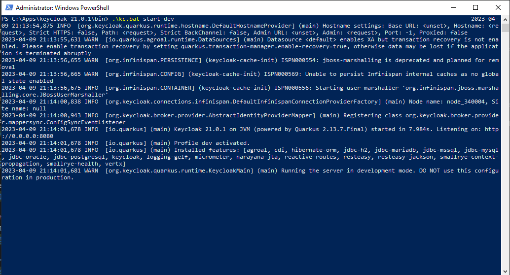
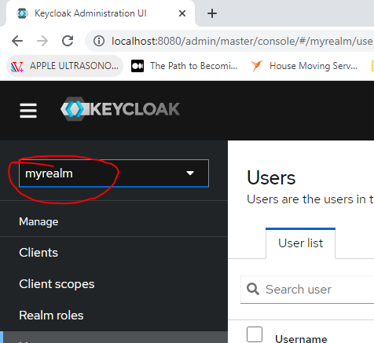
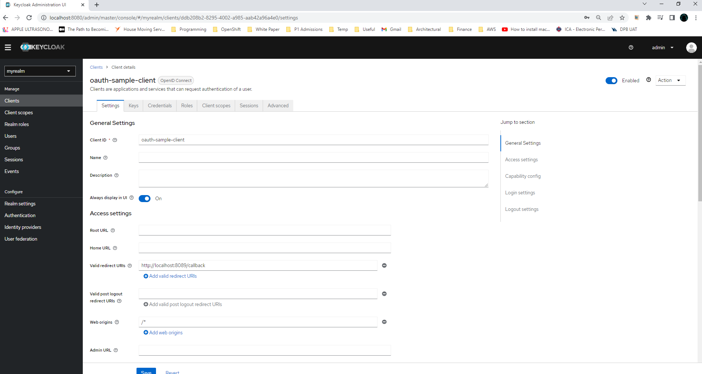
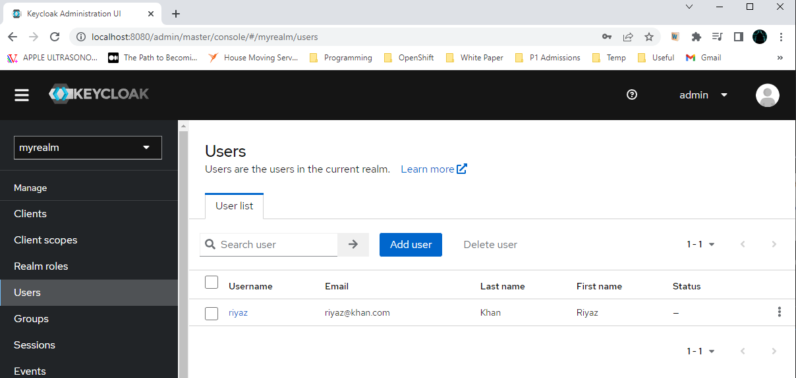
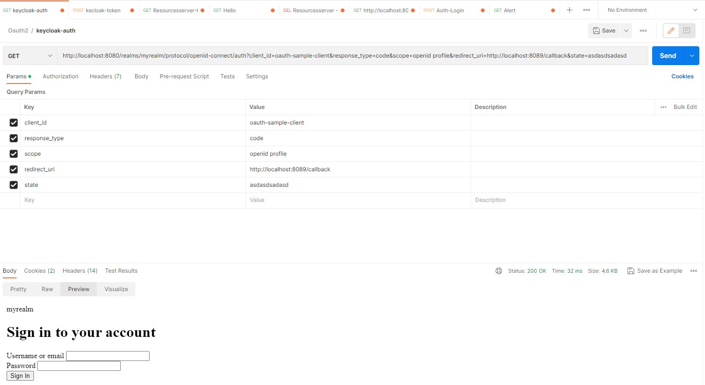
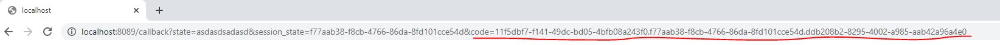
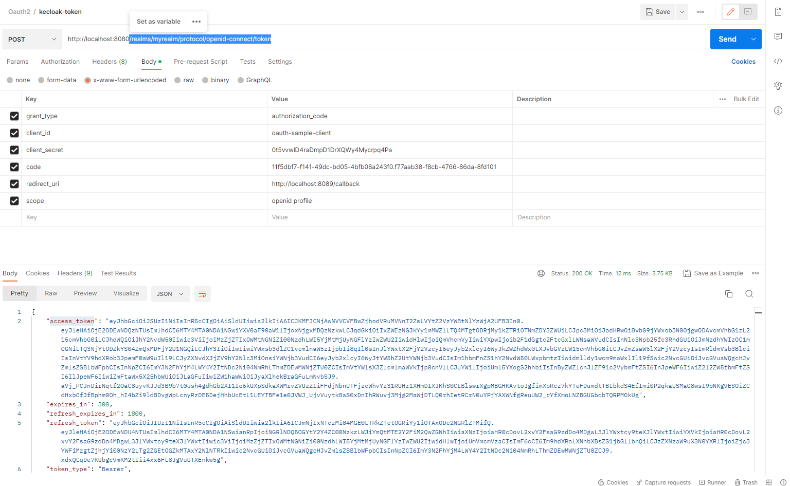
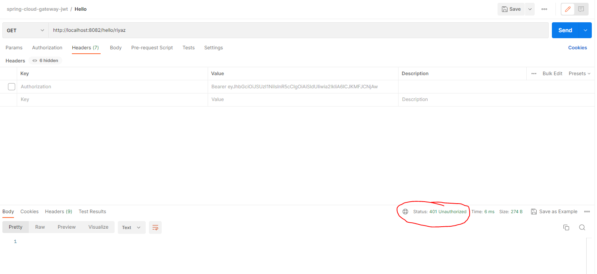
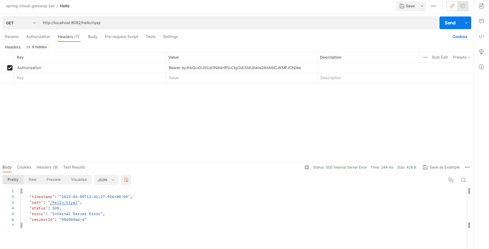

# Prerequisites / Tech Stack
* Keycloak server
* Spring Cloud gateway
* Java 8+
* Postman or SoapUI (For ease of API calls)

# Functionality
This project showcases spring cloud gateway's ability to act as resource server.  
The gateway component intecepts the requests coming in from client and validates oAuth2 token on keycloak IDP.  
spring-boot-starter-oauth2-resource-server is used to intercept and validate oAuth2 tokens on each request.  

# Setup Project Infra
In our case, we’ll use the Keycloak identity provider. We have to set up following things in keycloak after installation.

(If server startup fails try deleting file `keycloakdb.lock.db` from location keycloak home location `<keycloak-home>\data\h2`)

1. Start Keyclooak server locally 

2. Create Realm called _myrealm_

3. Create Client named _oauth-sample-client_

4. Create one user under this realm

# Get hold of _access_token_ to authorize resources under this gateway
1. call keycloak endpoint _/realms/myrealm/protocol/openid-connect/auth_ with query params given below. It'll prompt for credentials, and you'll have to key-in username and password created under keycloak (Step 3 under _Setup Project Infra_ section).

2. You'll get code as part of query params in the redirected url after you sign in

3. Use this code to get _access_token_ from keycloak endpoint _/realms/myrealm/protocol/openid-connect/token_

4. First send it without Authorization header and it'll fail.

5. It'll be successfully authorized to redirect after you use returned access_token in the header _Authorization_ with prefix _Bearer_ to call endpoint under this api gateway (resource server).
Ignore the error as our gateway is redirecting it to the server which is not running currently.

### Reference Documentation
For further reference, please consider the following sections:

* [Gateway](https://docs.spring.io/spring-cloud-gateway/docs/current/reference/html/)
* [Spring Boot Actuator](https://docs.spring.io/spring-boot/docs/3.0.4/reference/htmlsingle/#actuator)

### Guides
The following guides illustrate how to use some features concretely:

* [Using Spring Cloud Gateway](https://github.com/spring-cloud-samples/spring-cloud-gateway-sample)
* [Building a RESTful Web Service with Spring Boot Actuator](https://spring.io/guides/gs/actuator-service/)

